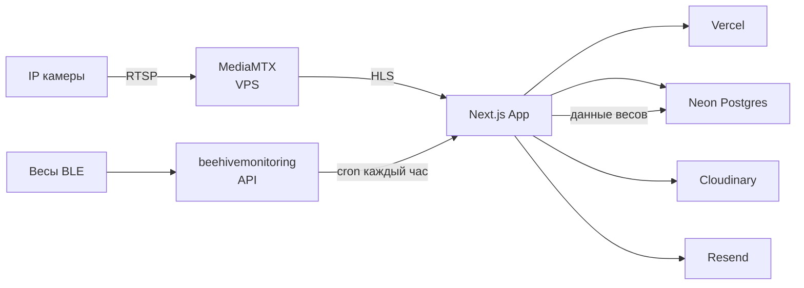
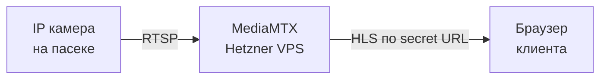
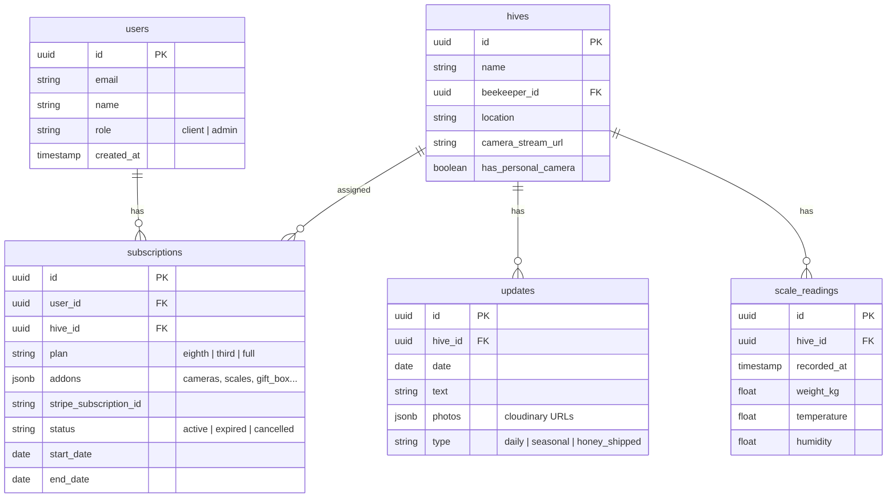
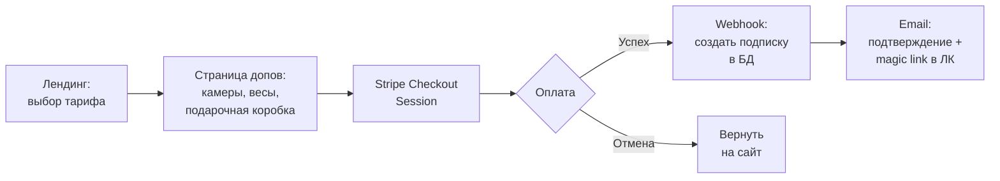

# Техстек сайта BeeSharing Poland

## О проекте

BeeSharing Poland — платформа «облачная пасека» в Польше. Клиент покупает долю улья (1/8, 1/3 или целый), получает мёд с именной этикеткой, доступ к камерам на пасеке и личный кабинет с обновлениями. Мы не владеем ульями — работаем с пчеловодами-партнёрами как платформа: берём на себя сайт, маркетинг, камеры/весы, ЛК, фасовку и доставку.

Тарифы: 1/8 улья (349 zł) → 1/3 (899 zł) → целый улей B2B (4 900 zł). Допродажи: камеры, весы, подарочные коробки, туры на пасеку. Год 1: 8 ульев, ~29 клиентов, 1 пчеловод. К году 5: 48 ульев, ~185 клиентов, 5 пчеловодов.

Подробнее: [[Концепция]], [[Тарифы]], [[Допродажи]], [[План масштабирования]]

---

## Обзор

Сайт = **лендинг** (продающий, GSAP-анимации) + **личный кабинет клиента** (дашборд, камеры, фото, весы) + **админка** (управление контентом, заказами) + **checkout** (выбор тарифа + допы → оплата).

Один разработчик, full-stack. Стек должен быть продуктивным, поддерживаемым и масштабируемым без команды.

---

## Архитектура



---

## Стек по слоям

### Frontend

| Компонент | Решение | Почему |
|---|---|---|
| **Фреймворк** | **Next.js 16** (App Router) | SSG для лендинга (SEO), SSR для кабинета, Server Actions для мутаций. Один проект — всё в одном |
| **UI библиотека** | **Tailwind CSS + shadcn/ui** | Красивые компоненты из коробки, полный контроль над кодом, тёмная/светлая тема. Готовые dashboard blocks (sidebar, data table, charts) — основа для админки и ЛК без вёрстки с нуля |
| **Анимации лендинга (DOM)** | **Motion** (`motion/react`) | Hardware-accelerated scroll animations (run on compositor, не JS). Spring physics, layout animations, 2.6KB. MIT лицензия. Для секций, текста, параллакса, hover/tap |
| **Анимации лендинга (3D)** | **GSAP** (ScrollTrigger) + **Three.js** — только если на лендинге будет 3D пчела | ScrollTrigger scrub для Three.js canvas. Без ScrollSmoother — он делает скролл неестественным и тяжёлым |
| **Формы** | **React Hook Form + Zod** | Валидация на клиенте и сервере из одной схемы |
| **Состояние** | **Server Components + React Query** | Server Components по умолчанию, React Query только для real-time данных (весы, статус камер) |

### Backend

| Компонент | Решение | Почему |
|---|---|---|
| **API** | **Next.js Server Actions + Route Handlers** | Не нужен отдельный бэкенд. Actions для мутаций (заказы, профиль), Route Handlers для webhooks (оплата) |
| **ORM** | **Drizzle ORM** | Type-safe, лёгкий, отличная поддержка Postgres. Миграции из коробки |
| **БД** | **Neon Postgres** (Vercel Marketplace) | Serverless Postgres, бесплатный tier (0.5 GB), $19/мес Pro. Branching для dev/staging |
| **Кэш** | **Next.js built-in cache** (`'use cache'`) | Лендинг закэширован статически, кабинет — динамический. Не нужен Redis на старте |

### Аутентификация

| Компонент | Решение | Почему |
|---|---|---|
| **Auth** | **NextAuth.js v5 (Auth.js)** | Бесплатный, self-hosted, credentials + magic link. Не нужен Clerk за $25/мес для ~30 клиентов в год 1 |
| **Провайдер входа** | **Email magic link** (основной) + **Google OAuth** (опционально) | Целевая аудитория не технари — magic link проще пароля. Google как fallback |
| **Сессии** | **JWT** (database sessions если нужно revoke) | Stateless, не нужен Redis |

> **Почему не Clerk:** При 29 клиентах в год 1 и ~185 к году 5 платить $25+/мес за auth — overkill. Auth.js бесплатен, mature, и достаточен. Миграция на Clerk возможна позже если понадобится SSO/RBAC.

### Оплата

| Компонент | Решение | Почему |
|---|---|---|
| **Платёжный процессор** | **Stripe** (основной) | Работает в Польше, поддерживает карты + Apple Pay + Google Pay. API отличный, документация лучшая |
| **BLIK/Przelewy24** | **Stripe + Przelewy24 интеграция** | Stripe нативно поддерживает Przelewy24 как payment method — не нужен отдельный провайдер |
| **Модель оплаты** | **Stripe Checkout Sessions** | Клиент выбирает тариф + допы → одна сессия оплаты → webhook подтверждает → доступ к ЛК |
| **Продление (год 2+)** | **Stripe Subscriptions** или ручной invoice | Подписка с ежегодным billing cycle. Stripe сам напоминает и списывает |

> **Stripe в Польше:** Przelewy24 (включая BLIK) доступен как payment method в Stripe. Включается одной строкой в конфиге. Клиент видит знакомый интерфейс BLIK, деньги идут на твой Stripe аккаунт. Комиссия ~1.5% для P24.

### Камеры и стриминг

| Компонент | Решение | Почему |
|---|---|---|
| **Медиасервер** | **MediaMTX** на VPS | RTSP → HLS конвертация. Бесплатный, Go, стабильный. Один инстанс тянет 10+ камер |
| **VPS** | **Hetzner** (Falkenstein или Helsinki) | €4.5/мес (CX22: 2 vCPU, 4GB RAM). Близко к Польше, дёшево, надёжно |
| **Протокол клиенту** | **HLS** (HTTP Live Streaming) | Работает в любом браузере через `<video>` или hls.js. Задержка 5-15 сек — для пчёл нормально |
| **Плеер** | **hls.js** (обёртка) или **Video.js** | Лёгкий, кастомизируемый. Можно стилизовать под бренд |
| **Защита (MVP)** | **Secret URL per hive** | Каждому улью генерируется уникальный неугадываемый путь: `media.domain.pl/hive-1-a8f3e9b2c1/stream.m3u8`. URL хранится в БД, ротируется раз в месяц. Просто, надёжно, нет точки отказа |
| **Защита (v2, 100+ клиентов)** | **JWT через webhook** | MediaMTX проверяет токен через callback на Next.js API. Добавляет ~50-100ms при старте потока (одноразово). Переходить когда secret URL станет недостаточно |



> **Почему secret URL на MVP:** HLS — это статические файлы (.m3u8 + .ts сегменты). Для 29 клиентов неугадываемый URL (UUID v4 в пути) — достаточная защита. Никто не будет брутфорсить потоки ульев. JWT через webhook добавляет сложность и точку отказа (MediaMTX дёргает Next.js API при каждом подключении) — не оправдано на старте.

> **Масштабирование:** Когда камер станет >10, перед MediaMTX ставится CDN (Cloudflare или BunnyCDN) для раздачи HLS-сегментов. Стоимость ~$5/мес на 100 зрителей.

### Данные весов

| Компонент | Решение | Почему |
|---|---|---|
| **Источник** | **beehivemonitoring HTTP API** | Весы → GSM шлюз → облако → наш cron забирает данные |
| **Сбор** | **Cron каждый час** → Route Handler `/api/cron/scales` | На Vercel Pro ($20/мес) — встроенный cron. На Hobby (бесплатный) — cron ограничен 1 раз/день, поэтому используем внешний триггер (cron-job.org или GitHub Actions) для вызова защищённого endpoint с секретным токеном |
| **Хранение** | **Neon Postgres** (таблица `scale_readings`) | Временные ряды: timestamp, weight, temp, humidity. ~8760 записей/год — Postgres справится |
| **Визуализация** | **Recharts** или **Chart.js** в React | Графики веса улья за день/неделю/сезон прямо в ЛК |

> **Почему не InfluxDB:** При 1 весах и 24 записях/день Postgres с индексом по timestamp справляется отлично. InfluxDB — overkill для MVP. Если пасек станет 5+ и записей >100K — можно мигрировать.

### Фото и контент

| Компонент | Решение | Почему |
|---|---|---|
| **Хранение фото** | **Cloudinary** | Auto-optimization, responsive images, transformations. Free tier: 25K трансформаций/мес, 25 GB storage |
| **Загрузка** | **Cloudinary Upload Widget** в админке | Drag-n-drop, auto-resize, EXIF strip. Минимум кода |
| **Отображение** | **next/image + Cloudinary loader** | Автоматическая оптимизация, lazy loading, AVIF/WebP |
| **Формат обновлений** | Таблица `updates` в Postgres | `{date, hive_id, photos[], text, type}`. Админка создаёт запись + загружает фото |

### Email

| Компонент | Решение | Почему |
|---|---|---|
| **Сервис** | **Resend** | Лучший API для транзакционных писем. Free tier: 3000 писем/мес (хватит на 185 клиентов). $20/мес за 50K |
| **Шаблоны** | **React Email** | JSX-шаблоны писем. Тот же стек что и сайт. Preview в браузере |
| **Типы писем** | Подтверждение заказа, magic link, сезонные обновления, мёд отправлен, напоминание о продлении | |

> **Критично: настройка домена для email.** Magic link — основной способ входа. Без правильных DNS-записей письма будут попадать в спам, особенно у Gmail и Outlook. Сразу после покупки домена `.pl` настроить:
> - **SPF** — разрешает Resend отправлять от имени твоего домена
> - **DKIM** — подписывает письма криптографически
> - **DMARC** — политика обработки неавторизованных писем
>
> Resend проводит через настройку при верификации домена. Без этого magic link **не будет работать надёжно** — а это единственный способ входа для клиентов.

### Хостинг и деплой

| Компонент | Решение | Стоимость |
|---|---|---|
| **Сайт + API** | **Vercel** (Hobby → Pro) | $0 (Hobby) → $20/мес (Pro, когда нужен) |
| **БД** | **Neon** (Free → Pro) | $0 → $19/мес |
| **VPS (камеры)** | **Hetzner CX22** | €4.5/мес (~20 zł) |
| **Фото** | **Cloudinary** (Free → Plus) | $0 → $89/мес (когда >25GB) |
| **Email** | **Resend** (Free → Pro) | $0 → $20/мес |
| **Домен** | `.pl` домен | ~50 zł/год |
| **SSL** | Vercel (авто) + Let's Encrypt (VPS) | $0 |
| **Итого MVP** | | **~25 zł/мес** (VPS + домен) |
| **Итого год 2+** | | **~250-350 zł/мес** (при росте) |

---

## Архитектура и практики

### Design Tokens — единый источник визуала

Брендинг создаётся с нуля. Все визуальные константы живут в **одном месте** — меняешь один раз, меняется везде.

**Цвета** — CSS-переменные в `globals.css` через shadcn/ui theming system:

```css
/* globals.css — shadcn oklch theme */
@layer base {
  :root {
    --background: 0 0% 100%;
    --foreground: 0 0% 3.9%;
    --primary: 47 96% 53%;        /* медовый/янтарный акцент */
    --primary-foreground: 0 0% 9%;
    --secondary: 120 20% 95%;     /* мягкий зелёный (природа) */
    --accent: 47 96% 53%;
    --card: 0 0% 100%;
    --border: 0 0% 89.8%;
    --ring: 47 96% 53%;
    /* ...остальные shadcn переменные */
  }
}
```

> **Правило:** никогда не использовать hex/rgb напрямую в компонентах. Только `bg-primary`, `text-foreground`, `border-border` и т.д. Когда бренд определится точнее — меняешь 5 строк в CSS, а не 200 компонентов.

**Шрифты** — через `next/font` в `layout.tsx`:

```tsx
// app/layout.tsx
import { Inter } from 'next/font/google'        // основной текст
import { Playfair_Display } from 'next/font/google' // заголовки лендинга (premium feel)

const sans = Inter({ subsets: ['latin', 'latin-ext'], variable: '--font-sans' })
const serif = Playfair_Display({ subsets: ['latin', 'latin-ext'], variable: '--font-serif' })
```

```ts
// tailwind.config.ts
fontFamily: {
  sans: ['var(--font-sans)', ...defaultTheme.fontFamily.sans],
  serif: ['var(--font-serif)', ...defaultTheme.fontFamily.serif],
}
```

> **Шрифты — предложение, не финал.** Inter — нейтральный, отлично читается. Playfair Display — для заголовков на лендинге, даёт premium-ощущение. Оба поддерживают польские диакритики (ą, ć, ę, ł, ń, ó, ś, ź, ż). Можно заменить когда определится бренд.

**Константы дизайна** — файл `lib/design.ts`:

```ts
// lib/design.ts — всё что не покрывает Tailwind/CSS vars
export const BRAND = {
  name: 'BeeSharing Poland',
  tagline: 'Twój ul. Twój miód.',
  domain: 'beesharing.pl',
} as const

export const BREAKPOINTS = {
  mobile: 640,
  tablet: 1024,
  desktop: 1280,
} as const

export const MOTION_DEFAULTS = {
  spring: { type: 'spring', damping: 20, stiffness: 300 },
  fadeIn: { initial: { opacity: 0, y: 30 }, whileInView: { opacity: 1, y: 0 } },
  stagger: 0.1,
} as const

// GSAP — только для 3D пчелы (если есть)
export const GSAP_DEFAULTS = {
  scrub: true,
  ease: 'none', // scroll-driven = no easing
} as const
```

### Компонентная архитектура

**Принцип:** Server Components по умолчанию, `'use client'` только когда нужна интерактивность. Граница `'use client'` — как можно ниже по дереву.

```
Компоненты делятся на 3 типа:

┌─────────────────────────────────────────────────────┐
│  UI (components/ui/)                                │
│  shadcn/ui компоненты. Не знают о бизнес-логике.    │
│  Button, Card, Table, Dialog, Input...              │
│  Импортируются отовсюду.                            │
└─────────────────────────────────────────────────────┘
         ↑ используют
┌─────────────────────────────────────────────────────┐
│  Feature (components/dashboard/, /landing/, /admin/) │
│  Бизнес-компоненты. Знают о данных, но не           │
│  фетчат их сами. Получают данные через props.       │
│  HiveCard, ScaleChart, PhotoFeed, CameraPlayer...   │
└─────────────────────────────────────────────────────┘
         ↑ используют
┌─────────────────────────────────────────────────────┐
│  Pages (app/**/page.tsx)                            │
│  Server Components. Фетчат данные, передают вниз.   │
│  Единственное место где вызываются db-queries.      │
└─────────────────────────────────────────────────────┘
```

**Правила:**
- **`page.tsx`** — Server Component, фетчит данные из БД, рендерит feature-компоненты
- **Feature-компоненты** — получают данные через props. Если нужен state/effect — `'use client'`
- **UI-компоненты** — чистый shadcn/ui, без бизнес-логики. Никогда не модифицировать напрямую — создать обёртку
- **Не дублировать layout между лендингом, ЛК и админкой** — у каждой route group свой `layout.tsx` с разным UI (лендинг — полноэкранный, ЛК — sidebar, админка — sidebar + breadcrumbs)

**Пример — страница камер:**
```
app/(dashboard)/kamery/page.tsx     → Server Component: проверяет подписку,
                                      получает stream URLs из БД
components/dashboard/camera-player.tsx → 'use client': hls.js плеер,
                                         получает streamUrl через props
components/ui/card.tsx              → shadcn Card, ничего не знает о камерах
```

### API и Data Layer

**Три слоя доступа к данным:**

```
┌──────────────────────────────────┐
│  1. Server Actions (app/actions/) │ ← мутации из UI (формы, кнопки)
│  createOrder(), updateProfile()   │   Валидация Zod на входе
└──────────────┬───────────────────┘
               │ вызывают
┌──────────────▼───────────────────┐
│  2. Route Handlers (app/api/)     │ ← webhooks (Stripe, cron),
│  POST /api/webhooks/stripe        │   внешние интеграции
│  GET  /api/cron/scales            │
└──────────────┬───────────────────┘
               │ вызывают
┌──────────────▼───────────────────┐
│  3. Data Access (lib/db/queries/) │ ← единственный слой работы с БД
│  getClientHives(), saveReading()  │   Drizzle queries, типизированные
└──────────────────────────────────┘
```

**Правила:**
- **Server Actions** — для всего что делает клиент: оформление заказа, изменение профиля, выбор этикеток, загрузка фото в админке. Валидация через Zod-схему на входе каждого action
- **Route Handlers** — только для webhook'ов (Stripe, cron) и потенциально публичного API. Не для UI-мутаций
- **`lib/db/queries/`** — единственное место где лежат SQL-запросы (Drizzle). Ни page.tsx, ни actions, ни route handlers не пишут SQL напрямую — всё через функции из queries

```ts
// lib/db/queries/hives.ts — пример
export async function getClientHives(userId: string) {
  return db
    .select()
    .from(subscriptions)
    .innerJoin(hives, eq(subscriptions.hiveId, hives.id))
    .where(eq(subscriptions.userId, userId))
}
```

```ts
// lib/validators/order.ts — одна Zod-схема, используется на клиенте и сервере
export const orderSchema = z.object({
  plan: z.enum(['eighth', 'third', 'full']),
  addons: z.array(z.enum(['cameras', 'scales', 'gift_box', 'premium_box', 'honey_sample'])),
  giftFor: z.string().optional(),
})
```

### Прочие практики

**Env-переменные** — строгая типизация:
```ts
// lib/env.ts — падает при старте если что-то не задано
import { z } from 'zod'

const envSchema = z.object({
  DATABASE_URL: z.string().url(),
  STRIPE_SECRET_KEY: z.string().startsWith('sk_'),
  STRIPE_WEBHOOK_SECRET: z.string().startsWith('whsec_'),
  RESEND_API_KEY: z.string().startsWith('re_'),
  CLOUDINARY_URL: z.string(),
  NEXTAUTH_SECRET: z.string().min(32),
  CRON_SECRET: z.string().min(16),
  BEEHIVE_MONITORING_TOKEN: z.string(),
})

export const env = envSchema.parse(process.env)
```

**Error boundaries** — graceful degradation:
- `app/(dashboard)/error.tsx` — если ЛК упал, показать «попробуйте позже» вместо белого экрана
- `app/(dashboard)/kamery/loading.tsx` — skeleton пока грузится стрим
- Камера оффлайн → показать последний скриншот + статус «камера недоступна»

**SEO лендинга:**
- `generateMetadata()` на каждой странице лендинга
- Open Graph изображения для шаринга в соцсетях (фото пасеки)
- JSON-LD schema: `LocalBusiness` + `Product` для тарифов
- `robots.txt` — разрешить лендинг, закрыть `/dashboard/*` и `/admin/*`

---

## Структура проекта (Next.js)

```
beesharing-poland/
├── app/
│   ├── (landing)/              # Лендинг (SSG, GSAP)
│   │   ├── page.tsx            # Главная
│   │   ├── cennik/page.tsx     # Тарифы
│   │   └── o-nas/page.tsx      # О нас
│   ├── (auth)/
│   │   ├── logowanie/page.tsx  # Вход (magic link)
│   │   └── rejestracja/page.tsx
│   ├── (dashboard)/            # ЛК клиента (SSR, protected)
│   │   ├── layout.tsx          # Sidebar, навигация
│   │   ├── page.tsx            # Обзор (главная ЛК)
│   │   ├── kamery/page.tsx     # Камеры (HLS плеер)
│   │   ├── waga/page.tsx       # Весы (графики)
│   │   ├── zdjecia/page.tsx    # Фотоотчёты
│   │   ├── etykiety/page.tsx   # Выбор этикеток
│   │   └── profil/page.tsx     # Профиль, подписка
│   ├── (admin)/                # Админка (protected, role=admin)
│   │   ├── layout.tsx          # shadcn Sidebar block — готовая навигация
│   │   ├── klienci/page.tsx    # shadcn Data Table block — список клиентов
│   │   ├── ule/page.tsx        # Управление ульями
│   │   ├── aktualizacje/page.tsx # Публикация обновлений
│   │   └── zamowienia/page.tsx # shadcn Data Table block — заказы
│   ├── api/
│   │   ├── auth/[...nextauth]/ # Auth.js
│   │   ├── webhooks/stripe/    # Stripe webhooks
│   │   └── cron/scales/        # Cron: данные весов
│   └── checkout/               # Checkout flow
├── components/
│   ├── landing/                # GSAP-секции лендинга
│   ├── dashboard/              # Компоненты ЛК
│   ├── admin/                  # Компоненты админки
│   └── ui/                     # shadcn/ui
├── actions/                    # Server Actions (мутации из UI)
│   ├── orders.ts               # createOrder, cancelOrder
│   ├── profile.ts              # updateProfile, changeEmail
│   └── admin.ts                # publishUpdate, assignHive
├── lib/
│   ├── db/
│   │   ├── schema.ts           # Drizzle schema (все таблицы)
│   │   ├── index.ts            # DB connection
│   │   └── queries/            # Единственный слой SQL-запросов
│   │       ├── hives.ts        # getClientHives, getHiveDetails
│   │       ├── orders.ts       # getOrders, createOrder
│   │       ├── updates.ts      # getUpdates, publishUpdate
│   │       └── scales.ts       # saveReading, getReadings
│   ├── validators/             # Zod-схемы (shared клиент + сервер)
│   │   ├── order.ts            # orderSchema
│   │   └── profile.ts         # profileSchema
│   ├── auth.ts                 # Auth.js config
│   ├── stripe.ts               # Stripe helpers
│   ├── cloudinary.ts           # Upload helpers
│   ├── scales-api.ts           # beehivemonitoring API client
│   ├── design.ts               # Бренд-константы (name, tagline, GSAP defaults)
│   ├── env.ts                  # Типизированные env-переменные (Zod)
│   └── email/                  # React Email templates
└── public/
    └── og/                     # OG-изображения для шаринга
```

---

## Модель данных (ключевые таблицы)



---

## Checkout Flow



---

## Анимации на лендинге — подход

### Motion (DOM-анимации — основной инструмент)

- **`scroll()`** для секций: hero → как это работает → тарифы → галерея → FAQ. Hardware-accelerated — работает на compositor thread, не блокируется тяжёлым JS
- **`spring`** для hover/tap на кнопках и карточках тарифов — естественная физика вместо easing curves
- **`AnimatePresence`** для переходов между страницами
- **`layout`** prop для плавных layout-анимаций (переключение тарифов, раскрытие FAQ)
- **Параллакс** на фото пасеки через `useScroll()` + `useTransform()` — hardware-accelerated
- **Motion + Next.js:** `'use client'` только для секций с анимациями. Остальной лендинг — Server Components для SEO

```tsx
'use client'
import { motion, useScroll, useTransform } from 'motion/react'

export function HeroSection() {
  const { scrollYProgress } = useScroll()
  const y = useTransform(scrollYProgress, [0, 1], [0, -200])

  return (
    <motion.div
      initial={{ opacity: 0, y: 40 }}
      whileInView={{ opacity: 1, y: 0 }}
      transition={{ type: 'spring', damping: 20 }}
    >
      <motion.img src="/paseka.jpg" style={{ y }} /> {/* параллакс */}
    </motion.div>
  )
}
```

### GSAP + Three.js (только для 3D пчелы, если будет на лендинге)

- **ScrollTrigger** `scrub: true` для привязки 3D анимации к скроллу
- **Theatre.js** для визуального редактирования keyframe-пути пчелы (экспорт JSON → production)
- **`useGSAP()`** hook из `@gsap/react` для cleanup
- **Без ScrollSmoother** — делает скролл неестественным и тяжёлым. Нативный скролл браузера лучше
- **Лицензия GSAP:** бесплатен с 2024 (все плагины, коммерческое использование). НО лицензия проприетарная (Webflow), запрещает использование в конкурирующих с Webflow инструментах. Motion — MIT

### Что НЕ использовать

| Отклонено | Почему |
|---|---|
| **ScrollSmoother** (GSAP) | Перехватывает нативный скролл, делает его «тяжёлым» и неестественным. Та же проблема что у Locomotive Scroll |
| **Locomotive Scroll** | Deprecated, сломанный `position: sticky`, проблемы с accessibility |
| **Lenis** | Не нужен — Motion scroll animations уже hardware-accelerated, добавлять Lenis поверх — лишний слой |
| **AOS** | Слишком простой (только CSS-классы). Motion даёт то же + spring + layout + scroll |
| **framer-motion-3d** | Deprecated, не поддерживается. Для 3D — GSAP + Three.js |

---

## Что НЕ нужно на MVP

| Отложить | Почему |
|---|---|
| i18n (EN, UA) | Польский рынок, 29 клиентов. Добавить next-intl когда будет спрос |
| Мобильное приложение | Пчелошеринг (РФ) осознанно не делал. PWA из коробки Next.js достаточно |
| Grafana / InfluxDB | Overkill для 1 весов. Postgres + Recharts |
| Redis | Нет real-time требований. Postgres + Next.js cache |
| CMS (Sanity/Strapi) | Админка в приложении проще для solo-dev |
| Kubernetes / Docker Compose | Vercel + 1 VPS. Не усложнять |
| A/B тестирование | Мало трафика. Просто итерировать |

---

## План реализации (очерёдность)

1. **Лендинг** — Next.js + GSAP + Tailwind + shadcn/ui. Деплой на Vercel. Страницы: главная, тарифы, о нас, контакт
2. **Checkout** — Stripe интеграция, выбор тарифа + допов, оплата, webhook
3. **Auth + ЛК (базовый)** — Auth.js magic link, страница профиля, статус подписки
4. **Камеры** — VPS + MediaMTX, HLS плеер в ЛК, JWT-защита потоков
5. **Весы** — Cron job, API beehivemonitoring, графики в ЛК
6. **Фото/обновления** — Админка для загрузки фото, лента обновлений в ЛК
7. **Email** — Resend + React Email: подтверждение, сезонные обновления
8. **Этикетки** — Выбор дизайна в ЛК (каталог изображений)
